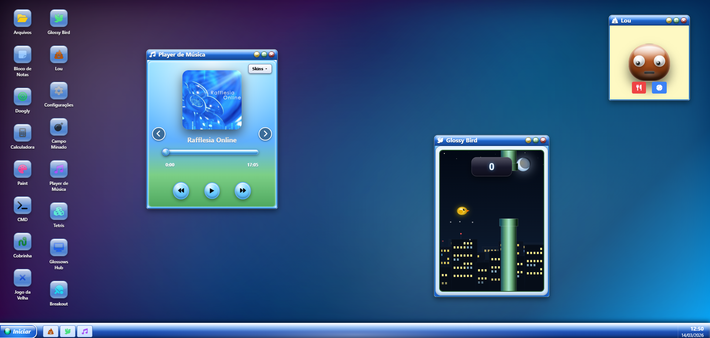

# 🖥️ Glossows XP

> Um sistema operacional fictício rodando direto no navegador, construído com HTML, CSS e JavaScript puro.



---

## ✨ Sobre o Projeto

**Glossows XP** é uma simulação de desktop estilo Windows feita inteiramente no front-end, sem nenhum framework ou back-end. O projeto conta com janelas arrastáveis, barra de tarefas, tela de bloqueio, menu Iniciar, múltiplos papéis de parede e um sistema completo de conquistas com XP.

---

## 🚀 Como Rodar

Não precisa instalar nada. Basta abrir o `index.html` no navegador.

```bash
# Clone o repositório
git clone https://github.com/seu-usuario/glossows-xp.git

# Abra o arquivo
cd glossows-xp
# Abra o index.html no seu navegador preferido
```

> ⚠️ Algumas funcionalidades (como carregar imagens locais no Paint) podem exigir um servidor local. Use a extensão **Live Server** no VS Code ou rode `npx serve .` na pasta do projeto.

---

## 📁 Estrutura de Arquivos

```
glossows-xp/
├── index.html      # Estrutura HTML do sistema
├── style.css       # Todos os estilos (skeuomorphismo, wallpapers, janelas)
├── script.js       # Lógica do sistema, apps e conquistas
└── img/
    ├── icon.png
    └── os_logo.png
```

---

## 🧩 Aplicativos

| App | Descrição |
|---|---|
| 📁 **Arquivos** | Gerenciador de arquivos fictício |
| 📝 **Bloco de Notas** | Editor de texto simples |
| 🎯 **Doogly** | Mecanismo de busca interno (com jogos secretos!) |
| 🔢 **Calculadora** | Calculadora funcional |
| 🎨 **Paint** | Editor de desenho com canvas |
| 💻 **CMD** | Terminal com comandos fictícios |
| 🐍 **Cobrinha** | Jogo clássico Snake |
| ✖️ **Jogo da Velha** | Tic-Tac-Toe contra a IA |
| 🐦 **Glossy Bird** | Clone do Flappy Bird |
| 💩 **Lou** | Personagem interativo surpresa |
| ⚙️ **Configurações** | Painel de configurações do sistema |
| 💣 **Campo Minado** | Minesweeper clássico |
| 🎵 **Player de Música** | Player com skins customizáveis |
| 🟦 **Tetris** | Tetris completo com pontuação |
| 🖥️ **Glossows Hub** | Central de conquistas e XP |
| 🏓 **Breakout** | Jogo de Breakout com fases |

### 🔒 Jogos Secretos (via Doogly)

Acesse o **Doogly** e pesquise para desbloquear:

| Pesquisa | Jogo |
|---|---|
| `glossyware` | GlossyWare — microjogos caóticos |
| `dorfight` | DORFight — jogo de luta |
| `wackender` | Wackender — shooter espacial |

---

## 🏆 Sistema de Conquistas

O Glossows XP possui **40+ conquistas** divididas em 5 raridades, cada uma concedendo XP ao jogador. O progresso é salvo automaticamente via `localStorage`.

| Raridade | Cor |
|---|---|
| 🟢 Common | Verde |
| 🔵 Uncommon | Azul |
| 🟣 Rare | Roxo |
| 🟡 Epic | Dourado |
| 🔴 Legendary | Vermelho |

---

## 🖼️ Papéis de Parede

Cinco wallpapers disponíveis, todos feitos 100% em CSS puro (sem imagens externas):

- **Holo** — gradiente escuro com bokeh holográfico
- **Vista** — recriação do clássico "Bliss" do Windows XP/Vista
- **Dark** — tema escuro com linhas vetoriais tecnológicas
- **Ubuntu** — paleta quente inspirada no Ubuntu
- **Binbows 7** — estilo Aero com esfera colorida do Windows 7

---

## ⚙️ Funcionalidades do Sistema

- **Tela de loading** com barra de progresso animada
- **Tela de bloqueio** com suporte a arraste (mouse e touch)
- **Menu Iniciar** com seletor de wallpaper e opção de desligar
- **Janelas arrastáveis** com z-index dinâmico (foco ao clicar)
- **Barra de tarefas** com relógio em tempo real
- **Animação de desligamento** com tela de fade out
- **Persistência** de XP, conquistas e wallpaper via `localStorage`

---

## 🛠️ Tecnologias

- **HTML5** — estrutura e canvas
- **CSS3** — animações, efeitos skeuomórficos e wallpapers em CSS puro
- **JavaScript (ES6+)** — lógica do sistema e dos apps
- [**Tailwind CSS**](https://tailwindcss.com/) (CDN) — utilitários de layout
- [**Font Awesome 6**](https://fontawesome.com/) (CDN) — ícones

> Nenhuma dependência instalável. Zero build step. Abre no navegador e funciona.

---

## 📄 Licença

Projeto pessoal para fins criativos e de portfólio. Feito com 💙 por **Renan Studios**.
